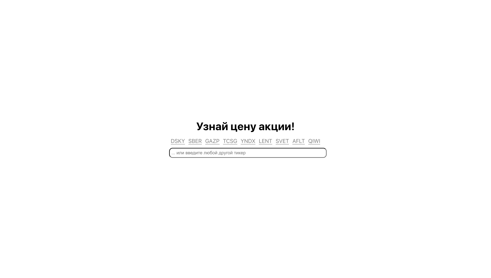
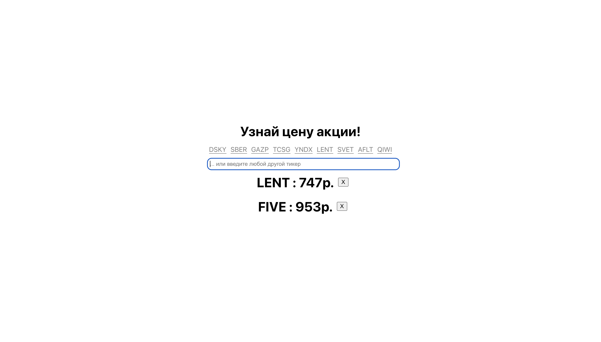

# Разработка виджета, отображающего котировки акций

## Выполнил Изгагин Д.К. группа АП-926

Этот проект был создан на [Create React App](https://github.com/facebook/create-react-app).

## Запустить проект:

Склонировав (`git clone`) репозиторий, нужно прописать:

### `npm start`

Приложение запустится, в браузерной строке открыть [http://localhost:3000](http://localhost:3000).

